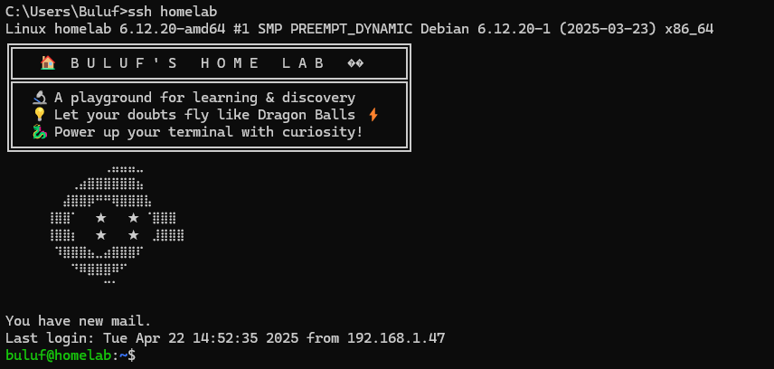

# 2-Tier Application with Vagrant using different environments

This project sets up some vms using vagrant, and to test the different types of environment we are using a **2-tier application** as example:
- **Database VM**: Hosts the database service.
- **Web Server VM**: Runs a PHP-based web application.

## 📌 Project Structure
```
using-vagrant/
│-- 2-tier-application/
│   │-- db/              # Database VM configuration
│   │   ├── Vagrantfile  # Vagrant setup for database
│   │-- webserver/       # Web server VM configuration
│   │   ├── Vagrantfile  # Vagrant setup for web server
│-- docker/             # Docker environment
│   ├── Vagrantfile     # Vagrant setup for Docker VM
│-- .gitignore          # Ignore .vagrant and other unnecessary files
│-- README.md           # Project documentation

```

## 🚀 Getting Started
### 1 Install Dependencies
Ensure you have the following installed:
- [VirtualBox](https://www.virtualbox.org/)
- [Vagrant](https://www.vagrantup.com/)

### 2 Clone the Repository
```bash
git clone https://github.com/buluf/using-vagrant.git
cd using-vagrant/2-tier-application
```

### 3 Start the Virtual Machines
```bash
cd 2-tier-application/db
vagrant up

cd ../webserver
vagrant up
```
This will provision and configure both the **database** and **web server** VMs.

### 4 Set VM User Access
To set the vm user variables you can use the .profile
```bash
echo 'export VM_USERNAME="<username>"' >> ~/.profile
echo 'export VM_USER_PASSWORD="<password>"' >> ~/.profile

source ~/.profile    # to load the variables into your shell environment
```
### 5 Access the WVMS
Once provisioning is complete, access the vms via:
```
ssh <username>@<vm_hostname>

```
or inside the vagrant dir

```
vagrant ssh

```

## ⚙️ Configuration
- The **database VM** runs **MySQL** (configured in `db/Vagrantfile`).
- The **web server VM** runs **PHP + Apache** (configured in `webserver/Vagrantfile`).
- Networking is set up so the web server can communicate with the database.


## Extra
All this is set up on my homelab — is a personal computer running within my local network. It is dedicated to testing and experimenting as part of my studies and learning journey.  



---
💡 **Contributions Welcome!** Feel free to fork, improve, and submit pull requests. 🚀
